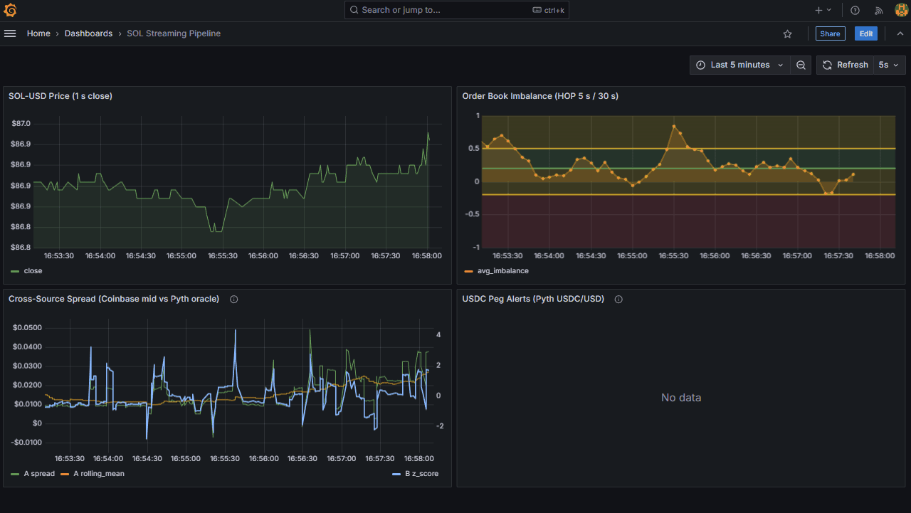
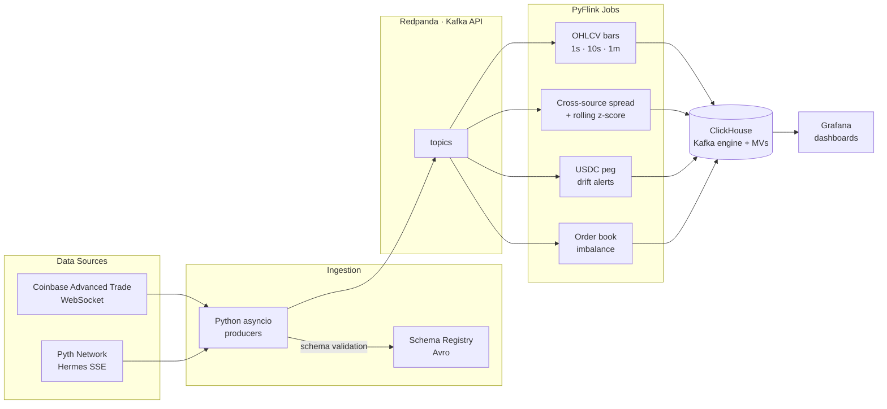

# token-stream-pipeline

[](LICENSE)

Real-time crypto pricing pipeline: Coinbase Advanced Trade WebSocket + Pyth Network oracle → Kafka (Redpanda) → PyFlink stream processing → ClickHouse → Grafana.



## Scope

Tracks SOL/USD and SOL/USDT across one centralized exchange and one on-chain oracle, computing cross-source spread, rolling OHLCV bars, order book imbalance, and USDC peg drift — all in real time. Please note that USDC peg drift only fires when USDC/USD deviates beyond threshold. No Data = peg is healthy.

## Stack

| Layer | Technology |
|---|---|
| Broker | Redpanda (Kafka API) |
| Schema | Schema Registry + Avro |
| Producers | Python asyncio |
| Stream processing | PyFlink |
| Storage | ClickHouse |
| Visualization | Grafana |
| Orchestration | Docker Compose |
| CI | GitHub Actions |

## Data sources

- **Coinbase Advanced Trade WebSocket** — `SOL-USD` and `SOL-USDT` market trades, ticker, and level2 order book
- **Pyth Hermes SSE** — SOL/USD and USDC/USD oracle prices

## Quick start

**Prerequisites:** Docker Desktop, Python 3.11+, [uv](https://github.com/astral-sh/uv)

```bash
# 1. Configure environment
cp .env.example .env          # no secrets needed — all sources are public/unauthenticated

# 2. Start the full stack (Redpanda, Schema Registry, Flink, ClickHouse, Grafana)
docker compose up -d

# 3. Run producers (each in its own terminal)
uv run python -m producers.coinbase_trades
uv run python -m producers.coinbase_ticker
uv run python -m producers.pyth_prices

# 4. Submit Flink jobs
docker compose exec flink-jobmanager flink run -py /opt/jobs/ohlcv_bars.py
docker compose exec flink-jobmanager flink run -py /opt/jobs/cross_source_spread.py
docker compose exec flink-jobmanager flink run -py /opt/jobs/usdc_peg_drift.py
docker compose exec flink-jobmanager flink run -py /opt/jobs/order_book_imbalance.py
```

| Dashboard | URL |
|---|---|
| Grafana | http://localhost:3000 |
| Redpanda Console | http://localhost:8080 |
| Flink Job Manager UI | http://localhost:8082 |

See [ROADMAP.md](ROADMAP.md) for the build plan and [CLAUDE.md](CLAUDE.md) for design decisions.

## Architecture



## Ports

| Service | Port |
|---|---|
| Redpanda Kafka (external) | 19092 |
| Redpanda Console | 8080 |
| Schema Registry | 8081 |
| Flink JobManager UI | 8082 |
| ClickHouse HTTP | 8123 |
| Grafana | 3000 |
